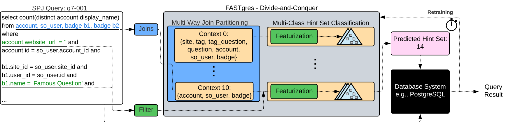

# FASTgres Optimizer

This directory contains the implementation of FASTgres, a learned optimizer that uses supervised learning (context-based gradient boosting) to predict beneficial hint sets for a given query workload.

This guide provides instructions for using FASTgres within the evaluation suite.

### Prerequisites

1.  The main Docker environment for the evaluation suite must be built and running.
2.  You have a Conda installation (e.g., [Miniconda](https://docs.conda.io/en/latest/miniconda.html)).

---

## 1. Environment Setup

All FASTgres commands must be run from a dedicated Conda environment.

1.  **Navigate to this directory:**
    ```bash
    cd optimizers/FASTgres-PVLDBv16
    ```
2.  **Create and activate the Conda environment:**
    ```bash
    conda env create -f environment.yml
    conda activate fastgres
    ```

---

## 2. Running FASTgres: A Multi-Step Pipeline

FASTgres is a supervised learning system that requires a data preparation pipeline to be run before training and evaluation.

### Step 1: Configure Database Connection
Before running any scripts, you must create a `.env` file in the root directory of the repository and populate it with your database connection details (host, port, user, password, etc.). You can use the provided `.env.example` as a template.

### Step 2: Generate Data Artifacts
This data preparation pipeline must be run once for each new workload.

*   **A. Generate Labels (`generate_labels.py`)**
    This script executes every query with every possible hint set to find the optimal one, creating a labeled "archive" file. **This step can be extremely time-consuming (hours or days).**
    ```bash
    python3 generate_labels.py <path/to/workload/> -o <path/to/save/archive.json> -db <db_name>
    ```

*   **B. Build Database Info (`update_db_info.py`)**
    This script gathers statistics from the database schema and workload, which are needed for featurization.
    ```bash
    python3 update_db_info.py <db_name> -mm db_info/{db_name}/ -l db_info/{db_name}/ -w db_info/{db_name}/ -q <path/to/workload/>
    ```

*   **C. Build Query Objects (`build_query_objects.py`)**
    This optional but highly recommended step pre-computes query representations to speed up the main training process.
    ```bash
    python3 build_query_objects.py <path/to/workload/> -sp <path/to/save/objects.pkl>
    ```

### Step 3: Train and Evaluate (`evaluate_queries.py`)
This is the main script that trains the FASTgres model on a training split and saves the resulting model ("frozen evaluation package").

```bash
python3 evaluate_queries.py <workload_path> \
    -db <db_name> \
    -a <archive.json> \
    -dbip <db_info_path> \
    -qo <query_objects.pkl> \
    -sd <results_dir> \
    -tcd <path/to/save/checkpoints/>
```
*   This script takes the artifacts from Step 2 as input.
*   `-tcd / --target_checkpoint_dir`: The directory where the final trained model and all related artifacts will be saved.

### Step 4: Dedicated Testing (`test_fastgres.py`)
This script is used to run inference with a pre-trained model on a new workload.

```bash
python3 test_fastgres.py <path/to/test/queries/> \
                         -D <db_name> \
                         --checkpoint_dir <path/to/load/checkpoints/> \
                         -o <path/to/results.log>
```
*   `<path/to/test/queries/>`: (Positional) Path to the directory with test queries.
*   `-D / --database`: The name of the database to connect to.
*   `--checkpoint_dir`: The directory containing the pre-trained model package to evaluate.
*   `-o / --output_dir`: The directory to save test results.

---

## 3. Replicating Paper Experiments

For the exact commands, model paths, and setup needed to generate the results for each experiment (E1-E5) in our paper, refer to the detailed guide below.

👉 [**FASTgres Experiment Reproduction Commands**](experiments.md)

---

### 4. Reference from original FASTgres Documentation
<details>
<summary><b>Click to expand for key concepts from the original FASTgres documentation.</b></summary>

**Supervised Learning Workflow**

Unlike many other LQOs that use reinforcement learning, FASTgres uses a **supervised learning** approach. This necessitates a distinct offline workflow:
1. **Labeling**: The ground truth (i.e., the best hint set for each query) must be established first by running all combinations. This is done by `generate_labels.py`.
2. **Featurization**: To represent queries as feature vectors, FASTgres requires statistical information about the database schema and workload, which is gathered by `update_db_info.py`
3. **Training/Evaluation**: The `evaluate_queries.py` script uses this labeled, featurized data to train a model (e.g., gradient boosting) and evaluate its predictive performance.



**config.ini**

This file is required and must be configured with your PostgreSQL connection details before any scripts will run correctly.

For more details, please refer to the complete [original_documentation.md](original_documentation.md) file.
</details>