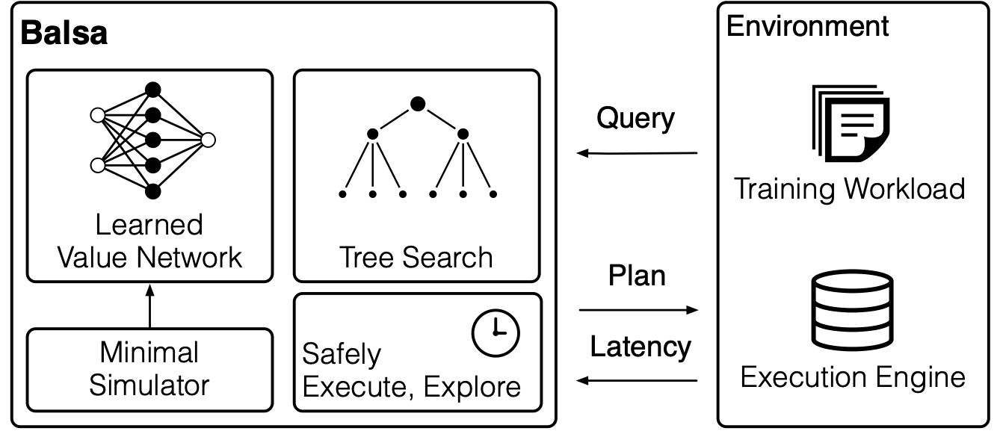

## NEO / Balsa Optimizer

This directory contains the Balsa codebase, which is used to run both the Balsa optimizer and our implementation of NEO. As noted in the main project README, the official NEO implementation was not publicly released, so we execute it through this framework.

This guide provides instructions specific to setting up and running experiments with NEO/Balsa within the evaluation suite.

**Prerequisites**

1. The main Docker environment for the evaluation suite must be built and running. This provides the necessary PostgreSQL database with all workloads pre-loaded.
2. You have a Conda installation (e.g., [Miniconda](https://docs.conda.io/en/latest/miniconda.html)).

--- 

### 1. Enivornment Setup

All Balsa/NEO commands must be run from a dedicated Conda environment.

1. Create and activate the Conda environment using the provided file:
```bash
conda env create -f environment.yml
conda activate balsa
```

2. Install the local pg_executor module:
```bash
pip install -e .
pip install -e pg_executor
```

Your environment is now ready.

---

### 2. Database Connection

**Important**: Before running any script, you must edit two files to select the target database:

1.  **Set Database Connection:** In `pg_executor/pg_executor/pg_executor.py`, uncomment the `DSN` line for your target database (e.g., `imdbload` for JOB).

    ```python
    # In pg_executor/pg_executor/pg_executor.py (around line 64)
    LOCAL_DSN = f"postgresql://{DB_USER}:{DB_PASS}@{DB_HOST}:{IMDB_PORT}/imdbload"
    # LOCAL_DSN = f"postgresql://{DB_USER}:{DB_PASS}@{DB_HOST}:{TPCH_PORT}/tpch"
    ```

2.  **Set Join Graph:** In `balsa/experience.py`, uncomment the `WithJoinGraph` line that matches your workload.

    ```python
    # In balsa/experience.py (around line 198)
    self.workload_info.WithJoinGraph(graphs.JOIN_ORDER_BENCHMARK_JOIN_GRAPH)
    # self.workload_info.WithJoinGraph(graphs.TPC_H_JOIN_GRAPH)
    ```

3. Re-install the local pg_executor module, if any changes were applied
```bash
pip install -e pg_executor
```

### 3. Running NEO / Balsa

Experiments are defined as classes in `experiments.py` and are launched using `run.py` for training and `test_model.py` for evaluation.

#### **General Training Command**
```bash
python run.py --run <ExperimentClass> \
              --workload_dir <path/to/train/dir> \
              --test_workload_dir <path/to/test/dir> \
              --workload_order <path/to/order.txt> \
              --target_checkpoint_dir <path/to/save/models/> \
              --local
```

- `--run <ExperimentClass>` : The name of the experiment class from experiments.py (e.g., `Neo_JOBLeaveOneOutSplit1`). This defines the model, hyperparameters, and workload.
- `--workload_dir <path/to/train/dir>`: Path to the directory containing the training workload SQL files.
- `--test_workload_dir <path/to/test/dir>`: Path to the directory containing the test/validation workload SQL files, used for periodic evaluation during training
- `--workload_order <path/to/order.txt>`: Path to a file specifying the order in which to process training queries. These are typically found within the main experiments/ directory.
- `--target_checkpoint_dir <path/to/save/models/>`: The directory where model checkpoints will be saved during training.

#### **General Testing Command**
```bash
python test_model.py --run <ExperimentClass> \
                     --checkpoint_dir <path/to/checkpoints/> \
                     --workload_dir <path/to/test/queries/> \
                     --test_workload_dir <path/to/test/queries/>
```
- `--run <ExperimentClass>`: The experiment class, used here to configure the model for testing.
- `--checkpoint_dir <path/to/checkpoints/>`: Path to the directory containing pretrained model checkpoints. You can train your own or download ours from the Hugging Face repository.
- `--workload_dir <path/to/train/queries/>`: Path to the directory containing the training workload SQL files.
- `--test_workload_dir <path/to/test/dir>`: Path to the directory containing the workload files for evaluation.

---

### 3. Replicating Paper Experiments

For the exact commands, model checkpoints, and workload paths used to generate the results for each experiment (E1-E5) in our paper, please refer to the detailed guide below. This file provides a copy-paste-ready list of commands for reproduction.

👉 [NEO/Balsa Experiment Reproduction Commands](experiments.md)

--- 

### 4. Reference from Original Balsa Documentation

<details>
<summary><b>Click to expand for key concepts from the original Balsa documentation.</b></summary>

#### **Balsa Overview**

Balsa is a learned query optimizer. It learns to optimize SQL queries by trial-and-error using deep reinforcement learning and a "sim-to-real" approach. It is notable for not relying on plan demonstrations from an existing expert optimizer.

<p align="center">

<p>

#### **Simulation Data Collection**

Balsa's sim-to-real learning model first trains an an agent in a simulated environment before moving to real database execution. The first time you run a training script on a new workload, the framework will automatically collect data to build this simulation model.

This process can take several minutes and the data is cached in a file like `data/sim-data-....pkl` for all future runs.

#### **Experiment Monitoring with Weights & Biases (W&B)**

The framework uses [**Weights & Biases**](https://wandb.ai/) for logging metrics. When you run a training script for the first time, you will be prompted to log in. We highly recommend creating a free account to visualize experiment progress.

#### **Key Metrics to Monitor in W&B:**

- **Agent Performance:**
  - `latency/workload`: Total execution time of Balsa's plans on the training queries.
  - `latency_test/workload`: Total execution time on the test queries.
- **Expert Performance (Baseline):**
  - `latency_expert/workload`: Total execution time of PostgreSQL's default plans on the training queries.
- **Training Progress:**
  - `curr_value_iter`: The current training iteration.
  - `num_query_execs`: Total number of unique query plans executed so far. This is a measure of data efficiency.
- **Plotting Efficiency:**
  - Plot `latency_test/workload vs. Relative Time (Wall)` for learning efficiency.
  - Plot `latency_test/workload vs. num_query_execs` for data efficiency.

#### **Troubleshooting**
- **"Hint not respected" error**: This can occasionally happen when PostgreSQL fails to respect a query plan hint generated by Balsa, which is a known limitation of the `pg_hint_plan` extension. We suggest relaunching the run if this occurs.

For more details on advanced topics like cluster-based training or diversified experience replay, please refer to the complete [original_documentation.md](original_documentation.md) file.

</details>